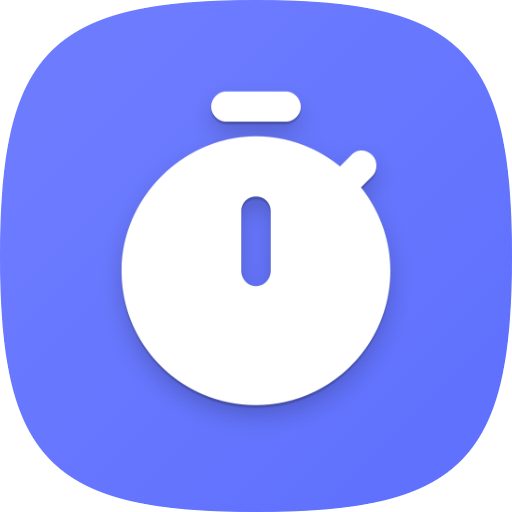
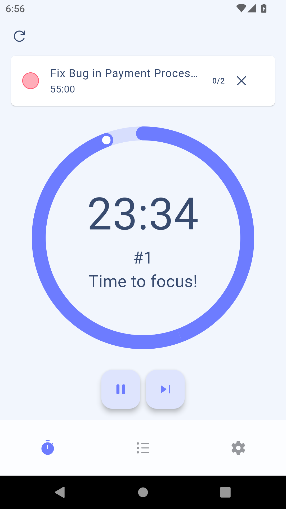
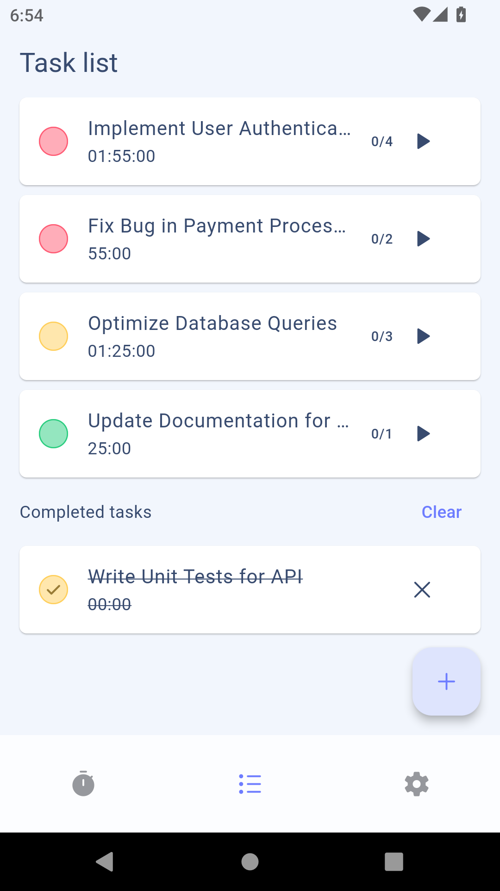
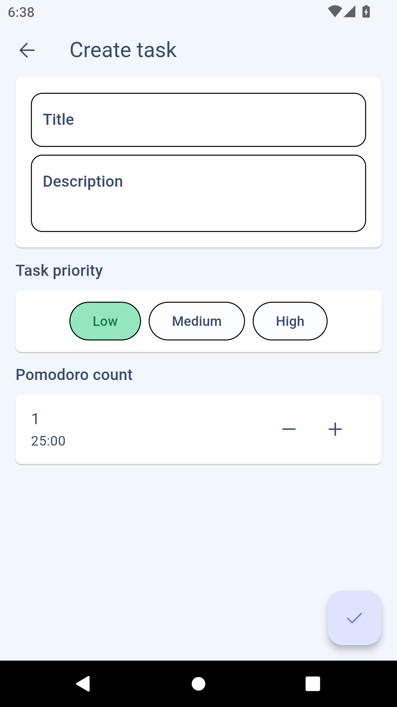
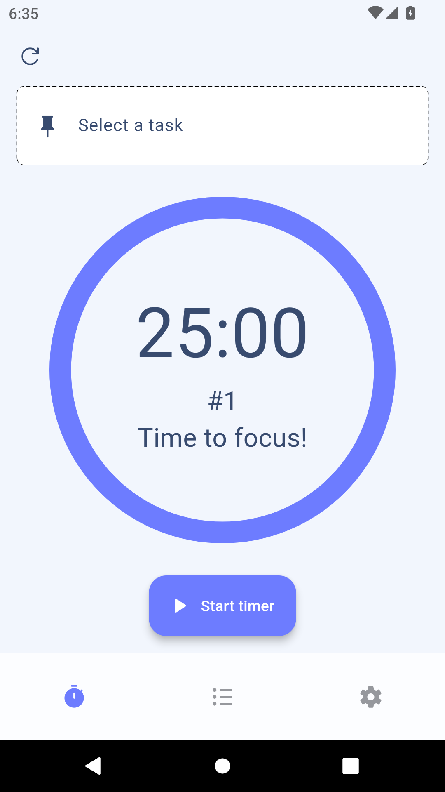
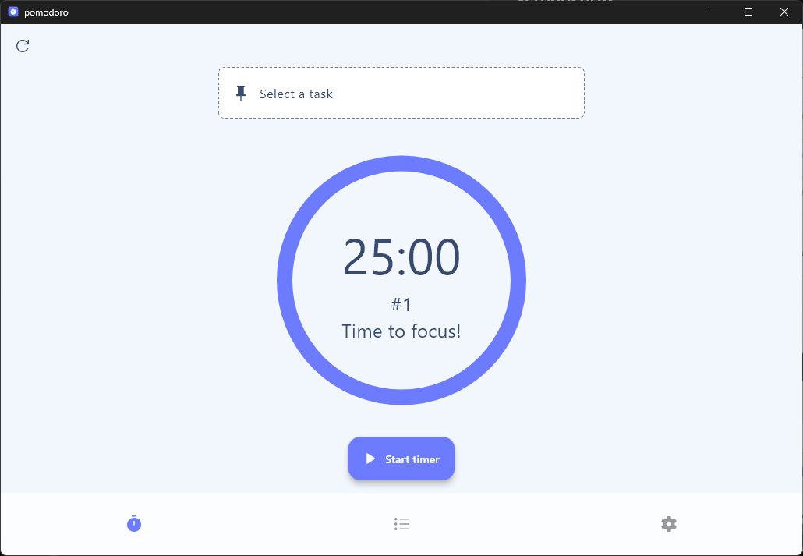

    

# PomoTask

The Pomodoro App is a fully cross-platform productivity tool built with Flutter, designed to help you manage your time effectively using the Pomodoro Technique. Whether you're on mobile, desktop, or the web, this app provides an intuitive interface and powerful features to enhance your focus and workflow.

## Features

- [x] **Cross-Platform:** Available on mobile (iOS & Android), desktop (Windows, macOS, Linux), and web.
- [x] **Pomodoro Timer:** Customize your work sessions and breaks to fit your style.
- [x] **Intuitive Design:** A clean and user-friendly interface for seamless navigation.
- [x] **Task List:** Easily add, edit, and organize tasks to stay on top of your workload.
- [x] **Estimated Time Tracking:** Real-time updates on task completion based on your current Pomodoro cycle.

## Usage

- **Set Your Tasks:** Optionally, you can use the task list feature to add tasks you want to complete. Simply click the “Add Task” button and enter your task details.
- **Start the Pomodoro Timer:** Choose your desired work session length (default is 25 minutes) and click "Start" to begin the timer. You can also pause the timer or skip sessions as needed.
- **Take Breaks:** After completing a Pomodoro session, the app will automatically prompt you to take a short break (default is 5 minutes). After every four Pomodoros, enjoy a longer break of 15 minutes to recharge!
- **Automatic Task Completion:** Tasks are automatically marked as complete when the timer ends, helping you stay organized.
- **Review Completed Tasks:** You can view a list of completed tasks and choose to restore any of them if needed. There's also an option to clear the completed tasks list with a single button click.
- **Track Progress:** As you work through your tasks, the app provides real-time updates on the estimated time to complete each task based on your Pomodoro and break cycles.

## Screenshots

    
    
    
    

## Implementation and Testing

| Platform | Implemented        | Manually Tested    |
| -------- | ------------------ | ------------------ |
| Windows  | :white_check_mark: | :white_check_mark: |
| Android  | :white_check_mark: | :white_check_mark: |
| Web      | :white_check_mark: | :white_check_mark: |
| Linux    | :warning:          | :warning:          |
| iOS      | :warning:          | :warning:          |
| macOS    | :warning:          | :warning:          |

> :warning: - This status indicates that the platform is expected to function, but due to resource constraints, other priorities are currently taking precedence. Once the code stabilizes, we will make an effort to conduct testing and implement any necessary changes.

## Contributing

We welcome contributions of all kinds! Here’s how you can help:

- **Code Contributions:** Check the [issues](https://github.com/fleetby/pomotask/issues) or [projects](https://github.com/fleetby/pomotask/projects) to see where you can contribute.
- **Report Bugs:** If you encounter any bugs or issues, please let us know by creating an issue.
- **Feature Requests:** Have an idea for a new feature? We'd love to hear your suggestions!

Your help makes this project better for everyone. Thank you for considering contributing!

## License

This project is licensed under the MIT License. See the [LICENSE](./LICENSE) file for details.