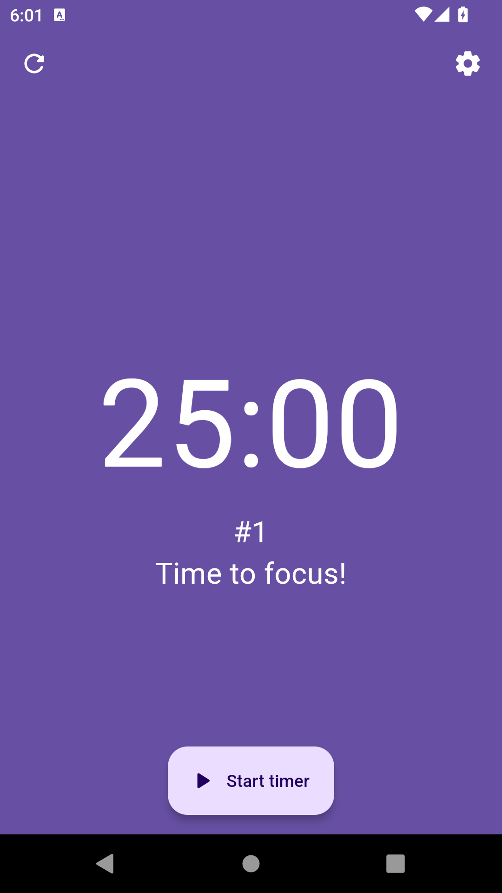
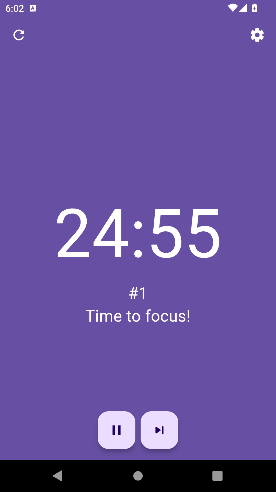
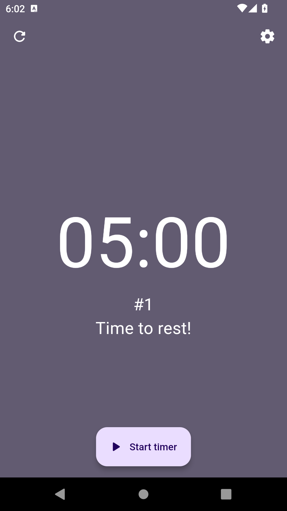

# Pomodoro
A simple Pomodoro app implementation in Flutter/Dart. This app helps you manage your time effectively by breaking it into work and rest intervals.


## Usage

1. Set your work and break intervals.
2. Start the timer and track your progress.
3. Take breaks and return to work.

## Screenshots

<div>
    
    
    
</div>

## Installation
1. Clone the repository:
   ```bash
   git clone https://github.com/fleetby/pomodoro.git
   ```
2. Navigate to the project directory:
   ```bash
   cd pomodoro
   ```
3. Install dependencies:
   ```bash
   flutter pub get
   ```
4. Run the app:
   ```bash
   flutter run
   ```

## Future Plans

- **To-Do List**: Implement a feature to create and manage a list of tasks.
- **Pinning Tasks**: Allow users to pin one task for the current Pomodoro session.
- **Background Notifications**: Enable Pomodoro notifications to work in the background for seamless time management.

## Contributing

If you would like to contribute, please fork the repository and submit a pull request with your changes. Contributions that implement the features outlined in the Future Plans section are especially welcome!


## License

This project is licensed under the MIT License.
